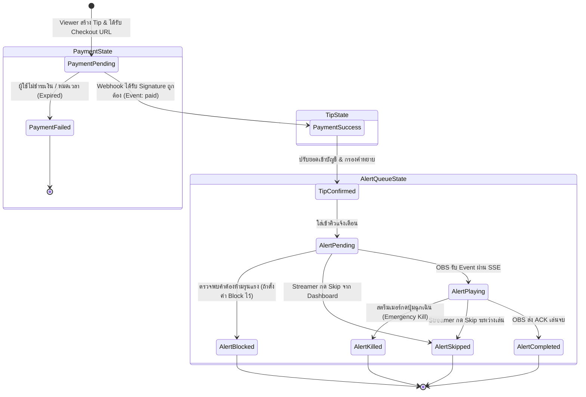

# สถาปัตยกรรมและแผนการสร้างระบบ Tip/Donate ส่วนตัว (Single Streamer) - Phase 1

เอกสารนี้ระบุรายละเอียดการออกแบบระบบบริจาค/ทิป (Tip & Donation System) สำหรับช่องสตรีมของผู้ใช้คนเดียว โดยเน้นความเสถียร ความปลอดภัยทางการเงิน และการแจ้งเตือนบน OBS แบบ Real-time

---

## 1. System Architecture (สถาปัตยกรรมระบบ)

```mermaid
flowchart TD
    subgraph ClientLayer ["Client Layer"]
        Viewer["👤 Viewer (Public Web)"]
        OBS["📺 OBS Browser Source (Alert Overlay)"]
        Admin["🛡️ Streamer (Admin Dashboard)"]
    end

    subgraph EdgeSecurity ["Security & Edge"]
        RateLimit["Rate Limiter (In-Memory / Sliding Window)"]
        WAF_Sanitize["Input Sanitizer & Zod Validation"]
    end

    subgraph AppServer ["Next.js 15 Application Server"]
        API_Public["/api/tips/create (Public API)"]
        API_Webhook["/api/webhooks/payment (Webhook Receiver)"]
        API_Overlay["/api/alerts/stream (SSE Stream)"]
        API_Admin["/api/admin/* (Protected Admin API)"]
        
        subgraph CoreServices ["Core Services"]
            PaymentAdapter["Payment Gateway Adapter\n(Stripe / Omise Sandbox)"]
            IdempotencyMgr["Idempotency & Signature Verifier"]
            ContentFilter["Content Filter & Word Blocklist Engine"]
            AlertQueueMgr["Alert Queue Manager & State Machine"]
            TTSGen["TTS Engine (Web Speech / Server Audio Engine)"]
        end
    end

    subgraph DataPersistence ["Persistence Layer (PostgreSQL / Prisma)"]
        DB_Tips[(Tips)]
        DB_Payments[(Payment Transactions)]
        DB_Alerts[(Alert Queue)]
        DB_Settings[(System Settings & Blocklist)]
        DB_Idempotency[(Webhook Events & Idempotency Keys)]
    end

    subgraph ExternalServices ["External Providers"]
        PaymentGateway["💳 Payment Gateway (e.g. Stripe/Omise Sandbox)"]
    end

    %% Flow connections
    Viewer -->|1. Submit tip form| RateLimit
    RateLimit --> WAF_Sanitize
    WAF_Sanitize --> API_Public
    API_Public -->|2. Create hosted session| PaymentAdapter
    PaymentAdapter -->|3. Redirect to Checkout| PaymentGateway
    
    PaymentGateway -->|4. Signed Webhook Event| API_Webhook
    API_Webhook --> IdempotencyMgr
    IdempotencyMgr -->|5. Verify signature & deduplicate| DB_Idempotency
    IdempotencyMgr -->|6. If valid & paid -> Save Tip & Enqueue Alert| ContentFilter
    ContentFilter --> DB_Tips
    ContentFilter --> DB_Payments
    ContentFilter --> DB_Alerts
    
    DB_Alerts --> AlertQueueMgr
    AlertQueueMgr --> API_Overlay
    API_Overlay -->|7. Server-Sent Events (SSE)| OBS
    OBS -->|8. Play Animation & TTS| OBS
    OBS -->|9. Ack: Alert Done| AlertQueueMgr

    Admin -->|Manage Tips / Trigger Test / Emergency Switch| API_Admin
    API_Admin --> AlertQueueMgr
    API_Admin --> DB_Settings
```

### หลักการสำคัญ (Guiding Principles)
1. **Zero Trust บน Frontend**: ข้อมูลจากหน้าบ้าน (จำนวนเงิน, สถานะ) ไม่มีความหมายใดๆ ในการยืนยัน ยอดเงินและสถานะสำเร็จต้องมาจาก Signed Webhook ที่ผ่านการตรวจสอบ Signature (HMAC SHA-256) โดยตรงจาก Gateway เท่านั้น
2. **Idempotency รับประกันครั้งเดียว (Exactly-Once Effect)**: บันทึก `event_id` ของ Webhook ทุกรายการลงฐานข้อมูลด้วย Transaction Lock หากมี Request ซ้ำเข้ามาจะ Return `200 OK` ทันทีโดยไม่ประมวลผลหรือ Enqueue Alert ซ้ำ
3. **Alert Queue Isolation**: ตัวคิว Alert แยกสถานะชัดเจน (`PENDING`, `PLAYING`, `PLAYED`, `SKIPPED`, `BLOCKED`) รองรับการ Retry, Manual Skip และ Emergency Kill Switch
4. **Real-time Delivery ผ่าน SSE (Server-Sent Events)**: เหมาะกับ OBS Browser Source มากที่สุดเพราะน้ำหนักเบา Reconnect อัตโนมัติในตัว ไม่ต้องพึ่งพา WebSocket Server แยก

---

## 2. Folder Structure (โครงสร้างโปรเจกต์)

โครงสร้างตาม Next.js 15 App Router แบบ Modular และ Clean Architecture:

```text
stream-tip-system/
├── .env.example
├── .gitignore
├── docker-compose.yml
├── Dockerfile
├── package.json
├── tsconfig.json
├── prisma/
│   ├── schema.prisma
│   ├── migrations/
│   └── seed.ts                     # สร้าง Admin Token / Default Settings / Sample Blocklist
├── public/
│   ├── alerts/                     # เสียงแจ้งเตือนเริ่มต้น (alert.mp3)
│   └── icons/
├── src/
│   ├── app/
│   │   ├── layout.tsx              # Root Layout
│   │   ├── page.tsx                # หน้า Public Tip Form สำหรับผู้ชม
│   │   ├── success/
│   │   │   └── page.tsx            # หน้าแสดงผลเมื่อบริจาคสำเร็จ (หลัง Redirect กลับ)
│   │   ├── cancel/
│   │   │   └── page.tsx            # หน้าแสดงผลเมื่อยกเลิก Checkout
│   │   ├── overlay/
│   │   │   └── page.tsx            # OBS Browser Source (Animation, Sound, TTS)
│   │   ├── admin/
│   │   │   ├── page.tsx            # Admin Dashboard (สถิติ, คิว Alert, จัดการ Blocklist)
│   │   │   └── login/
│   │   │       └── page.tsx        # Streamer Auth Gate (Token / Master Key)
│   │   └── api/
│   │       ├── tips/
│   │       │   └── route.ts        # POST: สร้าง Tip Request & Hosted Checkout Session
│   │       ├── webhooks/
│   │       │   └── payment/
│   │       │       └── route.ts    # POST: รับ Webhook ยืนยันเงินเข้า
│   │       ├── alerts/
│   │       │   ├── stream/
│   │       │   │   └── route.ts    # GET: Server-Sent Events (SSE) สำหรับ OBS
│   │       │   ├── ack/
│   │       │   │   └── route.ts    # POST: OBS รายงานว่าเล่น Alert จบแล้ว
│   │       │   └── test/
│   │       │       └── route.ts    # POST: Streamer กดทดสอบ Alert จำลอง
│   │       └── admin/
│   │           ├── tips/
│   │           │   └── route.ts    # GET: รายการ Tip ทั้งหมดพร้อมตัวกรอง
│   │           ├── queue/
│   │           │   ├── skip/route.ts   # POST: ข้าม Alert ปัจจุบัน
│   │           │   └── clear/route.ts  # POST: ล้างคิวที่ค้างอยู่
│   │           ├── settings/
│   │           │   └── route.ts    # GET/PUT: ตั้งค่าคำหยาบ, ความยาว, ค่าเปิด/ปิดฉุกเฉิน
│   │           └── emergency/
│   │               └── route.ts    # POST: ปิด Alert & TTS ทันที (Kill Switch)
│   ├── components/
│   │   ├── tip/
│   │   │   ├── TipForm.tsx         # ฟอร์มบริจาค (Amount presets, Name, Message, Anonymous)
│   │   │   └── TipSummary.tsx
│   │   ├── overlay/
│   │   │   ├── AlertBox.tsx        # การ์ดแสดงแจ้งเตือน (CSS Animation / Tailwind)
│   │   │   ├── TTSPlayer.tsx       # ส่วนควบคุม Web Speech API / Audio playback
│   │   │   └── AudioHandler.tsx    # เล่นเสียง Sound Effect
│   │   ├── admin/
│   │   │   ├── AlertQueueList.tsx  # ตารางแสดงคิวแจ้งเตือน Realtime
│   │   │   ├── TipHistoryTable.tsx # ประวัติการรับเงิน
│   │   │   ├── EmergencyPanel.tsx  # ปุ่มสีแดง Emergency Alert / TTS Kill Switch
│   │   │   └── SettingsForm.tsx    # จัดการ Blocklist & Thresholds
│   │   └── ui/                     # UI primitives (Button, Modal, Input, Badge, Switch)
│   ├── lib/
│   │   ├── db.ts                   # Prisma Client Singleton
│   │   ├── env.ts                  # Zod Validated Environment Variables
│   │   ├── rate-limit.ts           # In-memory sliding window rate limiter
│   │   ├── filter.ts               # Blocklist regex matcher & sanitization
│   │   ├── sse.ts                  # In-process SSE broadcaster manager
│   │   ├── auth.ts                 # Streamer admin session / bearer token check
│   │   └── payment/
│   │       ├── types.ts            # PaymentProvider Interface
│   │       ├── stripe-provider.ts  # Stripe Implementation (Sandbox Hosted Checkout)
│   │       └── index.ts            # Factory สำหรับเรียก Provider
│   └── types/
│       └── index.ts                # TypeScript DTOs และ Event Models
```

---

## 3. Database Schema (Prisma Schema)

```prisma
datasource db {
  provider = "postgresql"
  url      = env("DATABASE_URL")
}

generator client {
  provider = "prisma-client-js"
}

enum PaymentStatus {
  PENDING
  SUCCESS
  FAILED
  EXPIRED
}

enum AlertStatus {
  PENDING      // อยู่ในคิวรอแสดงผล
  PLAYING      // กำลังแสดงผลอยู่บน OBS
  COMPLETED    // แสดงผลเสร็จเรียบร้อย
  SKIPPED      // ถูกสตรีมเมอร์กดข้าม
  MUTED        // เล่นเฉพาะภาพแต่ปิดเสียง/TTS (หากตรวจพบคำต้องสงสัย)
  BLOCKED      // ถูกระบบคัดกรองคำหยาบระงับอัตโนมัติ
}

model Tip {
  id              String         @id @default(uuid())
  donorName       String         @db.VarChar(50)       // ชื่อที่แสดง (หรือ 'ผู้ไม่ประสงค์ออกนาม')
  rawDonorName    String         @db.VarChar(50)       // ชื่อดั้งเดิมก่อน normalize
  isAnonymous     Boolean        @default(false)
  amount          Decimal        @db.Decimal(10, 2)
  currency        String         @default("THB") @db.VarChar(3)
  message         String?        @db.VarChar(255)      // ข้อความจำกัดความยาว
  cleanMessage    String?        @db.VarChar(255)      // ข้อความหลังลบ/เซนเซอร์คำไม่เหมาะสม
  hasFilteredWord Boolean        @default(false)
  createdAt       DateTime       @default(now())
  updatedAt       DateTime       @updatedAt

  paymentTransaction PaymentTransaction?
  alertQueue         AlertQueue?

  @@index([createdAt])
}

model PaymentTransaction {
  id              String        @id @default(uuid())
  tipId           String        @unique
  tip             Tip           @relation(fields: [tipId], references: [id], onDelete: Cascade)
  
  provider        String        @db.VarChar(30)       // เช่น "stripe", "omise"
  providerTxId    String?       @unique               // Provider Session ID หรือ Charge ID
  amountCharged   Decimal       @db.Decimal(10, 2)
  currency        String        @db.VarChar(3)
  status          PaymentStatus @default(PENDING)
  checkoutUrl     String?       @db.Text
  paidAt          DateTime?
  
  createdAt       DateTime      @default(now())
  updatedAt       DateTime      @updatedAt

  @@index([providerTxId])
  @@index([status])
}

model AlertQueue {
  id              String       @id @default(uuid())
  tipId           String       @unique
  tip             Tip          @relation(fields: [tipId], references: [id], onDelete: Cascade)
  
  status          AlertStatus  @default(PENDING)
  priority        Int          @default(0)           // ยอดเงินสูงอาจให้ priority สูงขึ้น
  soundUrl        String?      @db.VarChar(255)
  durationSeconds Int          @default(8)
  ttsEnabled      Boolean      @default(true)
  
  displayedAt     DateTime?
  completedAt     DateTime?
  createdAt       DateTime     @default(now())
  updatedAt       DateTime     @updatedAt

  @@index([status, priority, createdAt])
}

model WebhookEventLog {
  id            String    @id @default(uuid())
  provider      String    @db.VarChar(30)
  eventId       String    @unique                      // ID จาก Provider สำหรับป้องกัน Webhook ซ้ำ (Idempotency)
  eventType     String    @db.VarChar(100)
  payloadJson   Json
  processed     Boolean   @default(false)
  createdAt     DateTime  @default(now())

  @@index([eventId])
}

model SystemSetting {
  id                  String   @id @default("default")
  streamerName        String   @default("Streamer")
  minTipAmount        Decimal  @default(10.00) @db.Decimal(10, 2)
  maxMessageLength    Int      @default(150)
  minAmountForTTS     Decimal  @default(20.00) @db.Decimal(10, 2)
  alertDurationSec    Int      @default(8)
  
  // Emergency Controls
  emergencyAlertMuted Boolean  @default(false)         // สั่งปิดการแสดง Alert ทันที
  emergencyTTSMuted   Boolean  @default(false)         // สั่งปิด TTS ทันที
  
  // Content Moderation
  bannedWords         String[] @default([])            // รายการคำต้องห้าม
  blockEntireMessage  Boolean  @default(false)         // ถ้ามีคำหยาบ: true = ซ่อนทั้งข้อความ, false = ทำเป็นดาว ***
  
  updatedAt           DateTime @updatedAt
}
```

---

## 4. API Contract (ข้อกำหนด API ละเอียด)

### 4.1 Public API: Create Tip Session
- **Endpoint**: `POST /api/tips`
- **Rate Limit**: 10 requests / minute / IP
- **Request Body (Validated by Zod)**:
  ```json
  {
    "donorName": "Somchai Gamer",
    "isAnonymous": false,
    "amount": 100,
    "message": "สู้ๆ ครับ ชอบสตรีมนี้มาก"
  }
  ```
- **Validation Rules**:
  - `donorName`: String 1-50 chars (ถ้า anonymous เป็น true ให้ใช้ 'ผู้ไม่ประสงค์ออกนาม')
  - `amount`: Number >= `minTipAmount` (เช่น 10 THB)
  - `message`: String สูงสุด 150 chars (Sanitized XSS tags)
- **Response `201 Created`**:
  ```json
  {
    "success": true,
    "tipId": "c3e98160-...",
    "checkoutUrl": "https://checkout.stripe.com/c/pay/cs_test_..."
  }
  ```

### 4.2 Webhook API: Payment Confirmation (Source of Truth)
- **Endpoint**: `POST /api/webhooks/payment`
- **Security**: ตรวจสอบ Header Signature เช่น `Stripe-Signature` ด้วย Secret Key
- **Processing Flow**:
  1. ดึง Raw Body เพื่อคำนวณ HMAC SHA-256 เทียบกับ Signature Header
  2. ตรวจสอบ `eventId` ใน `WebhookEventLog`:
     - หากมีอยู่แล้วและ `processed == true` -> ส่ง `200 OK` กลับทันที (Idempotent)
  3. บันทึก `WebhookEventLog`
  4. ทำงานใน `prisma.$transaction`:
     - อัปเดต `PaymentTransaction` เป็น `SUCCESS`, บันทึก `paidAt`
     - สร้างแถวใน `AlertQueue` สถานะ `PENDING`
  5. กระตุ้น Broadcast สัญญาณ SSE ไปยัง OBS ทันที
- **Response**: `200 OK` `{"received": true}`

### 4.3 Real-time OBS Overlay: Server-Sent Events (SSE)
- **Endpoint**: `GET /api/alerts/stream?token=SECRET_OVERLAY_TOKEN`
- **Authentication**: Secret Token ใน Query Parameter เพื่อป้องกันคนอื่นเปิดแอบดูคิว
- **Event format**:
  ```text
  event: alert
  data: {
    "alertId": "a901f...",
    "donorName": "Somchai Gamer",
    "amount": 100,
    "currency": "THB",
    "message": "สู้ๆ ครับ ชอบสตรีมนี้มาก",
    "ttsEnabled": true,
    "soundUrl": "/alerts/default.mp3",
    "duration": 8
  }
  ```

### 4.4 OBS Acknowledgment
- **Endpoint**: `POST /api/alerts/ack`
- **Body**: `{"alertId": "a901f..."}`
- **Behavior**: ปรับสถานะ Alert ในฐานข้อมูลเป็น `COMPLETED` และดึง Alert รายการถัดไปส่งผ่าน SSE

### 4.5 Admin Control Endpoints (Protected by Admin Auth)
- `GET /api/admin/tips`: รายการทิปและสถานะการจ่าย
- `POST /api/admin/alerts/test`: ส่ง Alert จำลองเข้า Overlay
- `POST /api/admin/alerts/skip`: ข้าม Alert ปัจจุบัน (`SKIPPED`)
- `POST /api/admin/alerts/clear`: ล้างคิวที่รออยู่ทั้งหมด
- `POST /api/admin/emergency`: สั่ง Toggle ปิด/เปิด Alert และ TTS ทันที
- `GET/PUT /api/admin/settings`: แก้ไขคำหยาบ (Blocklist) และค่าตั้งต้น

---

## 5. State Machines (Payment, Tip และ Alert)



---

## 6. แผนพัฒนาเป็นขั้นตอน (Phased Implementation Roadmap)

### Step 1: Project Setup, Docker & Data Model
- สร้าง Next.js 15 App ด้วย TypeScript และ Tailwind CSS
- ติดตั้ง Prisma, PostgreSQL, Docker Compose
- กำหนด Schema ใน `prisma/schema.prisma` พร้อม Seed ข้อมูล Admin & Settings

### Step 2: Payment Provider Adapter & Webhook Idempotency
- สร้าง Payment Gateway Adapter Pattern (รองรับ Stripe Test Mode/Sandbox เป็นค่าเริ่มต้น)
- สร้าง Route `POST /api/tips` สำหรับสร้าง Hosted Checkout Session
- สร้าง Route `POST /api/webhooks/payment` พร้อมการตรวจสอบ Signature และตาราง `WebhookEventLog` ป้องกัน Webhook ซ้ำ

### Step 3: Content Moderation & Queue Management
- โมดูลกรองคำหยาบ (Blocklist Regex & Sanitization) และจำกัดความยาว
- ระบบจัดการคิว Alert ในฐานข้อมูลตามลำดับเวลาและ Priority

### Step 4: Real-time OBS Overlay & TTS
- Route Server-Sent Events (`/api/alerts/stream`) พร้อม Reconnect อัตโนมัติ
- หน้า Overlay สำหรับ OBS Browser Source (`/overlay?token=...`)
- อนิเมชันการเด้งแจ้งเตือน, เสียงเอฟเฟกต์ (Audio), และระบบ TTS (Web Speech API)
- ระบบส่ง Acknowledgment กลับมายัง Server เมื่อแจ้งเตือนแสดงผลเสร็จ

### Step 5: Admin Dashboard & Emergency Controls
- หน้า Admin Protected Route (สำหรับสตรีมเมอร์คนเดียว)
- แสดงประวัติ Tip, คิว Alert Real-time, ปุ่ม Skip, ปุ่ม Clear Queue
- แผงควบคุมฉุกเฉิน (Emergency Kill Switch): ปิดเสียง/ปิด Alert ทันที
- ฟอร์มทดสอบ Alert (Test Donation) และปรับแต่ง Blocklist

### Step 6: Documentation & Verification
- สร้าง `docker-compose.yml` สำหรับรัน PostgreSQL และ Next.js ในคำสั่งเดียว
- สร้าง `.env.example` พร้อมคู่มือวิธีเอา Stripe Sandbox Keys
- จัดทำ `README.md` อธิบายขั้นตอนการติดตั้ง, ตั้งค่าใน OBS และการทดสอบ

---

## 7. การประเมินความเสี่ยงและมาตรการทดสอบ (Risk Analysis & Testing)

| ความเสี่ยง (Risk) | ผลกระทบ | มาตรการป้องกัน (Mitigation) |
|---|---|---|
| **Webhook Spoofing (ปลอมแปลงยอดเงิน)** | ร้ายแรงสูง (มี Alert ปลอมโดยไม่ได้เงินจริง) | ต้องตรวจสอบ Cryptographic Signature ของ Webhook ทุกครั้งด้วย Raw Body เท่านั้น |
| **Duplicate Webhook Delivery** | สูง (Alert เด้งซ้ำ 2 รอบ) | ใช้ `WebhookEventLog` และ DB Unique Constraint บน `eventId` |
| **XSS ในข้อความบริจาค** | ร้ายแรง (Script injection ใน OBS Browser Source) | Sanitize ข้อความผ่าน Zod + React auto-escaping ห้ามใช้ `dangerouslySetInnerHTML` |
| **OBS Reconnect / Network Hiccup** | ปานกลาง (Alert ค้างหรือหลุด) | ใช้ SSE พร้อม Heartbeat ping ทุก 15 วิ และ client-side auto-reconnect |
| **Spam / DoS ในหน้า Public Tip** | ปานกลาง (เซิร์ฟเวอร์โหลดสูง) | In-Memory Sliding Window Rate Limiting บน `/api/tips` |
| **คำหยาบคายหลุดขึ้นสตรีม** | สูง (ช่องสตรีมเมอร์อาจโดนแบน) | มี Blocklist อัตโนมัติ + ตัวเลือก Mute ข้อความ + ปุ่ม Emergency Kill Switch บนแดชบอร์ด |

### สิ่งที่ต้องทดสอบ (Verification Checklist)
1. **Webhook Signature Test**: ส่ง Request ที่ signature ผิด -> ต้องได้ `400/401` ปฏิเสธ
2. **Idempotency Test**: ยิง Webhook ตัวเดิม 3 ครั้งติดต่อกัน -> สถานะสำเร็จแค่ 1 ครั้ง และ Alert คิวมีแค่ 1 รายการ
3. **Public Tip Validation**: ป้อนข้อความยาวเกิน 150 ตัวอักษร, ยอดเงินติดลบ, สคริปต์ `<script>` -> ต้องถูกปฏิเสธหรือตัดทอน
4. **OBS Live Alert & TTS**: ยิง Webhook สำเร็จ -> OBS ได้รับ Event ผ่าน SSE แสดงผลและพูดข้อความได้ถูกต้อง
5. **Emergency Button**: เมื่อสตรีมเมอร์กด Emergency Mute -> OBS หยุดเล่นเสียงและข้อความทันที
